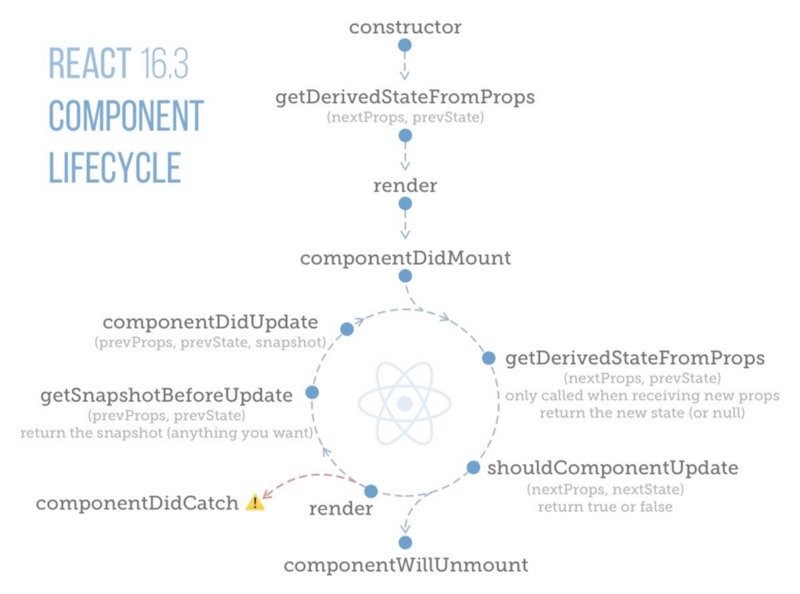

export { hack as theme } from 'mdx-deck/themes'
import { Appear } from 'mdx-deck'

# What is React
---
## 自己紹介
|||
|:--|:--|
|Atsushi Fujisawa||
|digitalstage Inc.|Front End Engineer|  
|GitHub|https://github.com/f-a24|
|Qiita|https://qiita.com/f-a24|
---
## Agenda
* What is React
* Concept
* Advantage
* How to use
* Environment
* Component
* Props & State
* Lifecycle
* Flux
* Server Side Rendering
* Ecosysytem
---
## What is React
FacebookがOSSとして公開しているUIを構築するためのJavaScriptライブラリ

A JavaScript library for building user interfaces

https://reactjs.org/
---
## Concept
<ul>
  <Appear>
    <li>Declarative<br />宣言型</li>
    <li>Component-Based<br />コンポーネントベース</li>
    <li>Learn Once, Write Anywhere<br />一度学び、どこにでも書く</li>
  </Appear>
</ul>
---
Declarative

高階コンポーネントなど関数型の思考
---
Component-Based

UIをコンポーネント(部品)として構築
---
Learn Once, Write Anywhere

Webだけではなくモバイルアプリ、VR等も可能

* [React Native](https://facebook.github.io/react-native/)
* [React360](https://facebook.github.io/react-360/)
---
## Advantage
<ul>
  <Appear>
    <li>
    	仮想DOMという作りで画面を差分更新することによって描画が速い<br />
    	（時と場合によりけり）
    </li>
    <li>コンポーネント単位で作っていくため管理がしやすい</li>
  </Appear>
</ul>
---
Therefore…
<ul>
  <Appear>
    <li>HTMLを操作するためのものではない</li>
    <li>サーバー側はデータを返すだけのような仕組みにする必要がある</li>
    <li>jQueryとの併用も可能だが好ましくはない</li>
  </Appear>
</ul>
---
## How to use

index.html

```html
  <body>
    <div id="root"></div>
    <script src="index.js"></script>
  </body>
```

---

App.jsx

```jsx
export default class App extend React.Component {
  constructor(props) {
    super(props);
  }
  render() {
    return (
      <div>
        <h1>Hello, world!</h1>
      </div>
    );
  }
}
```
---

index.js

```jsx
import App from './App';
ReactDOM.render(
  <App />,
  document.getElementById('root')
);
```

---
Resulet

```html
  <body>
    <div id="root">
      <div>
        <h1>Hello World!</h1>
      </div>
    </div>
    <script src="index.js"></script>
  </body>
```

---
## Environment

* [Create React App](https://github.com/facebook/create-react-app)
* [My Boilerplate](https://github.com/f-a24/react-start)
* [CDN](https://raw.githubusercontent.com/reactjs/reactjs.org/master/static/html/single-file-example.html)

---
## Component
---

Statefull Component

```jsx
class App extend React.Component {
  constructor(props) {
    super(props);
    this.state = { data: '' };
    this.inputHandler = this.inputHandler.bind(this);
  }
  inputHandler (e) {
    this.setState({ data: e.target.value });
  }
  render() {
    return (
      <div className="msg">
        <p style={{color: 'skyblue'}}>{this.state.data}</p>
        <Input onChange={this.inputHandler} />
      </div>
    );
  }
}
```

---
Stateless Functional Component

```jsx
const SFCApp = ({msg}) => <h1>{props.msg}</h1> 
```

---
## Props & State

---

## Lifecycle

---

マウントに関するメソッド
* constructor
* componentWillMount ※
* static getDerivedStateFromProps
* render
* componentDidMount

---

アップデートに関するメソッド
* componentWillReceiveProps ※
* static getDerivedStateFromProps
* shouldComponentUpdate
* componentWillUpdate ※
* getSnapshotBeforeUpdate
* componentDidUpdate

---
アンマウントに関するメソッド

* componentWillUnmount

---

エラーハンドリングに関するメソッド

* componentDidCatch

---

末尾に※が付いているものは今後のバージョンアップで削除予定

---



---

[公式ドキュメント](https://reactjs.org/docs/react-component.html#the-component-lifecycle)

[Qiitaで個人的にまとめたもの](https://qiita.com/f-a24/items/40b83d4c6c7d147cda9e)

---
## Flux
---
## Server Side Rendering
---
## Ecosysytem
---
# Thanks!!