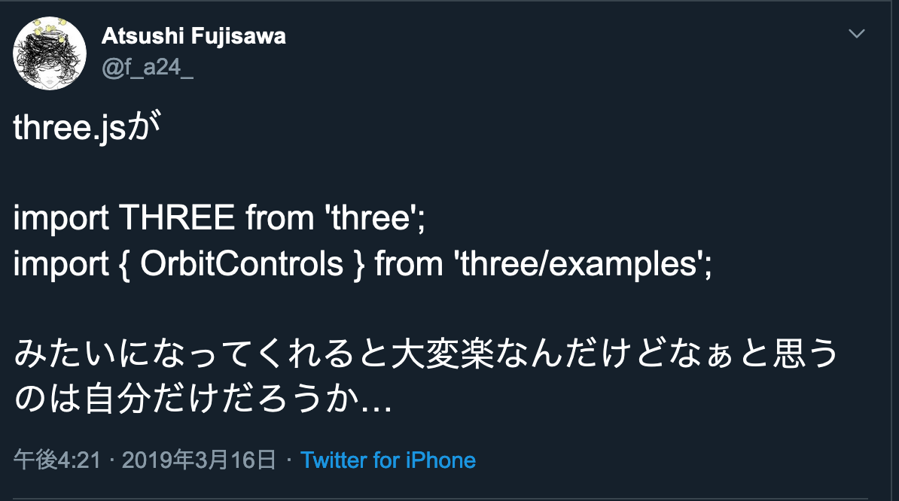

export { book as theme } from 'mdx-deck/themes';
import { Appear } from 'mdx-deck'

# Three.js＠TypeScript

2019-11-20  
[Three.js Meetup Tokyo #0](https://www.meetup.com/ja-JP/Three-js-User-Group/events/266011583/) LT  
Atsushi Fujisawa

---

## About me

|||
|:--|:--|
||Atsushi Fujisawa|
|Job|Frontend engineer @digitalstage Inc.|
|Twitter|[@f_a24_](https://twitter.com/f_a24_)|
|GitHub|[f-a24](https://github.com/f-a24)|

普段はTypeScriptでReact書いたり、jQueryと戦っている  
Three.jsは趣味で勉強中

---

## 初めてのLTなのでどうか温かい目で見ていただければと思います🙇‍♂️

---

## 今日話すこと
TypeScriptでThree.jsを使ってみてどうだったか

---

## １年前
<ul>
  <Appear>
    <li>😃「前々から気になっていたThree.js勉強するぞー！！」</li>
    <li><a href="https://www.oreilly.co.jp/books/9784873117706/">初めてのThree.js 第2版</a>を購入 </li>
    <li>😃「あ、せっかくだしTypeScriptやWebpack環境でやってみよ」</li>
  </Appear>
</ul>

---

Repository  
https://github.com/f-a24/three-sandbox
 
※うまく動作していないのもあるのでご了承ください

---

## 開始当初（r96ぐらい）

---

<ul>
  <Appear>
    <li>😃「おんや？」 </li>
    <li>😃「examplesがESModules（import/export）になっていない？」</li>
    <li>imports-loader（webpack plugin）で解決 </li>
  </Appear>
</ul>

---

<ul>
  <Appear>
    <li>😃「おんや？」 </li>
    <li>😃「型定義が無い？」</li>
    <li>自分で定義して解決 </li>
  </Appear>
</ul>

---

# ツラい😭

---

不意に呟く

---

---

# ！！！

---

# Mr.doob！？

---

<ul>
  <Appear>
    <li>でも、若干求めていた答えではなかった</li>
    <li>しかし、追求する勇気は出ず…</li>
  </Appear>
</ul>

---

## １年後
<ul>
  <Appear>
    <li>😃「久しぶりにThree.js再開するかー！」</li>
    <li>😃「とりあえずバージョンアップしよ」</li>
  </Appear>
</ul>

---

---

# キタァァァッ！！

---

<ul>
  <Appear>
    <li>😃「あれ？でもなんか型定義が間違っているような…」 </li>
    <li>思い切って<a href="https://github.com/mrdoob/three.js/pull/17459">PR</a>（ドキドキ）</li>
    <li>無事マージ </li>
  </Appear>
</ul>

---

🎉初めてのOSSコントリビュート🎉

---

# 😭😭😭😭😭

---

😃「あれ？他にもちょいちょいあるぞ？」

* https://github.com/mrdoob/three.js/pull/17460
* https://github.com/mrdoob/three.js/pull/17472
* https://github.com/mrdoob/three.js/pull/17657

---

他にも改善の余地はありそう🤔
 

---

# まとめ

---

<ul>
  <Appear>
    <li>型定義などのTypeScript関係はコントリビュートチャンス！</li>
    <li>拡張が必要そうであればimports-loader（サードパーティ製とか）</li>
    <li>【余談】@types/threeは必要ない（npm i threeだけで良い）</li>
  </Appear>
</ul>

---
# Thanks!!